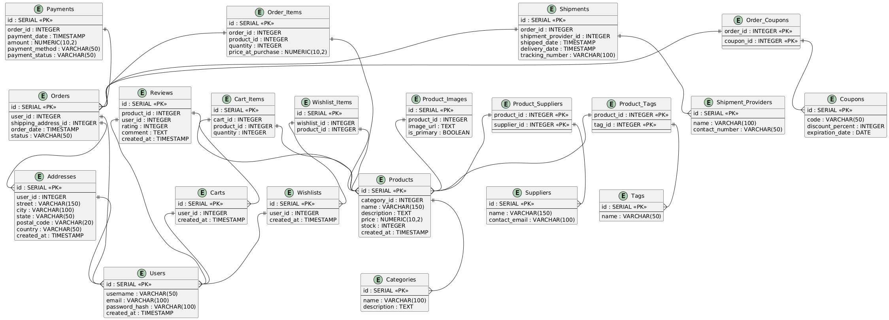

# ERD Generator

A lightweight Python tool that generates Entity Relationship Diagrams (ERDs) from SQLite3 databases using PlantUML.

## Example ERD



## Features

- **Automatic Schema Extraction**: Analyzes SQLite3 databases and extracts table structures, columns, and relationships
- **Visual ERD Generation**: Creates ERD diagrams using PlantUML
- **Unique Output**: Generates diagrams with UUID-based filenames to prevent conflicts

## Quick Start

1. Clone the repository:

```bash
git clone https://github.com/IgorTuchel/erd-generator.git
cd erd-generator
```

2. Install dependencies:

```bash
pip install requests
```

3. Generate your ERD:

```bash
cd src
python main.py path/to/your/database.db
```

Your ERD will be saved as a PNG file in the `../erd/` directory.

## How It Works

The tool follows a simple workflow:

1. **Connect** to your SQLite3 database
2. **Extract** table schemas, columns, and foreign key relationships
3. **Generate** PlantUML entity-relationship syntax
4. **Render** the diagram using PlantUML's web service
5. **Save** the resulting PNG image with a unique filename

## Requirements

- Python 3.6+
- `requests` library
- Internet connection (for PlantUML web service)

## Project Structure

```
src/
├── main.py              # CLI entry point
├── create.py            # Core orchestration
├── extract_sqlite_db.py # Database schema extraction
├── tables.py            # Data model classes
├── plantuml.py          # PlantUML code generation
└── client.py            # Web service client
```

## Example Output

Generated ERDs display:

- **Tables** as entities with their column definitions
- **Primary keys** highlighted with special notation
- **Foreign key relationships** as connecting lines between tables
- **Data types** for all columns

## Limitations

- SQLite3 databases only
- Requires internet connection
- Fixed output directory (`../erd/`)
- PNG format only

---

## Potential Future Improvements

### Core Improvements

- **Error Handling**: Better error messages and network failure recovery
- **Configuration**: Allow custom output directories
- **Dependencies**: Add `requirements.txt` and proper package structure
- **Logging**: Optional verbose output for debugging

### Database Support

- **Multiple Database Types**: PostgreSQL, MySQL, SQL Server support
- **Advanced Schema Elements**: Indexes, constraints, triggers, and views
- **Schema Filtering**: Include/exclude specific tables or patterns

### Output Enhancements

- **Multiple Formats**: SVG, PDF, and raw PlantUML text export
- **Diagram Customization**: Color themes, layout options, and styling
- **Offline Mode**: Local PlantUML installation support
- **Batch Processing**: Handle multiple databases at once

---

## Made By

Igor Tuchel
ITuchel@pm.me
